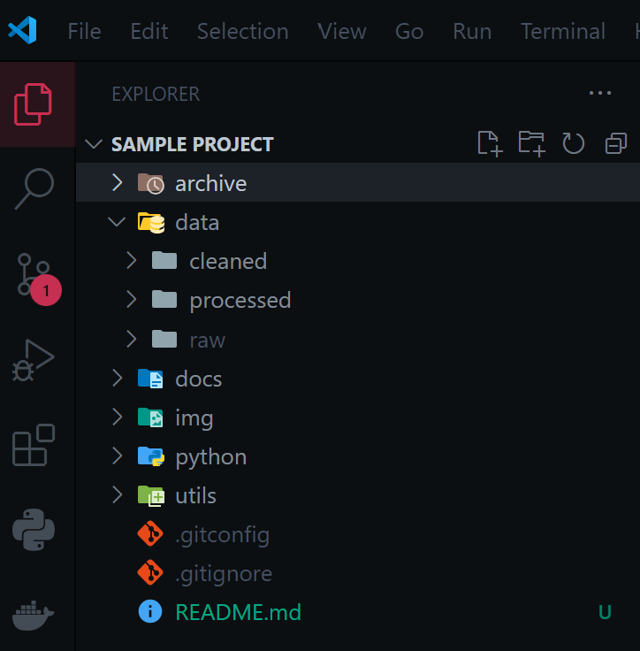

 
  <h1 align="center">Set up data projects</h1>
  

    <a href="https://github.com/christian-jaimes/set-up-data-projects/issues">Report Bug</a>
    -
    <a href="https://github.com/christian-jaimes/set-up-data-projects/issues">Request Feature</a>
  

This batch file streamlines the setup of my data projects by automating the creation of common directories, ensuring an organized structure, and configuring and initializing Git. It also launches Visual Studio Code in the newly created project folder.  

 
My typical workflow involves starting Anaconda to create and activate the project environment. 

 

Once that's done, I simply run this file (C:/setup_project.bat) from my conda environment then I select the options I want for my project.
 

 

At the end I have vscode ready for my project quickly and efficiently.
